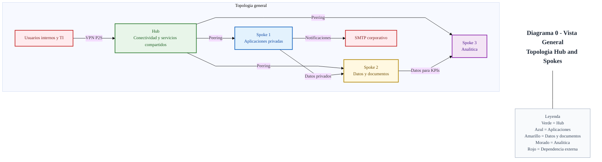
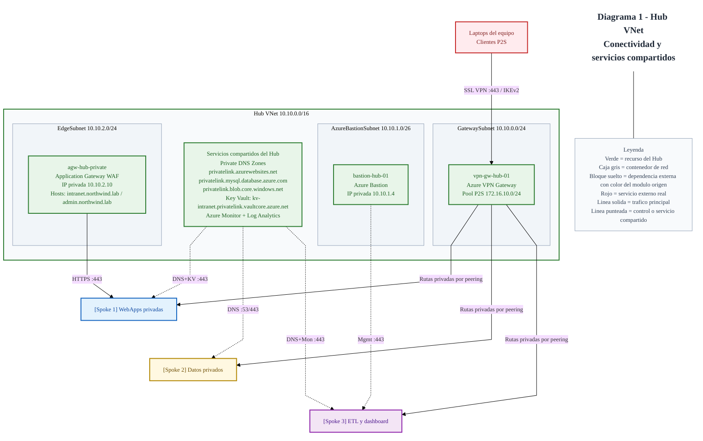
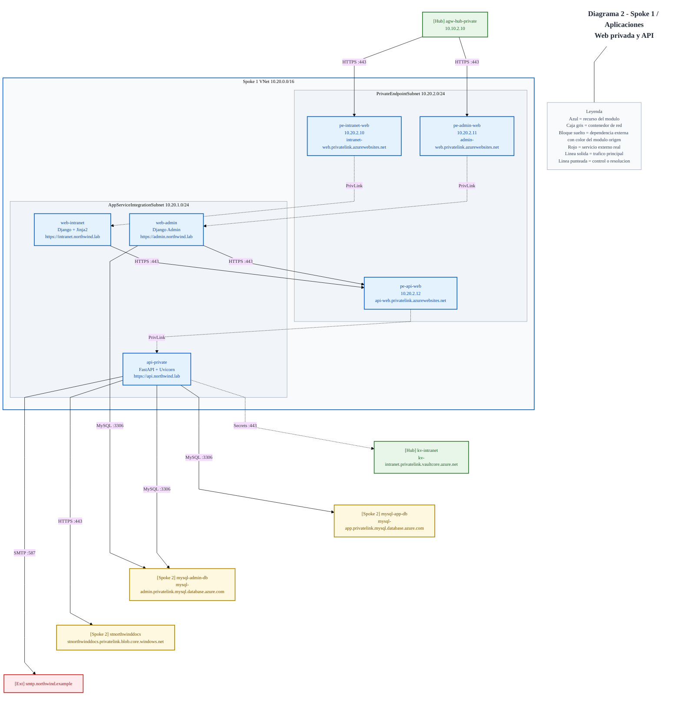
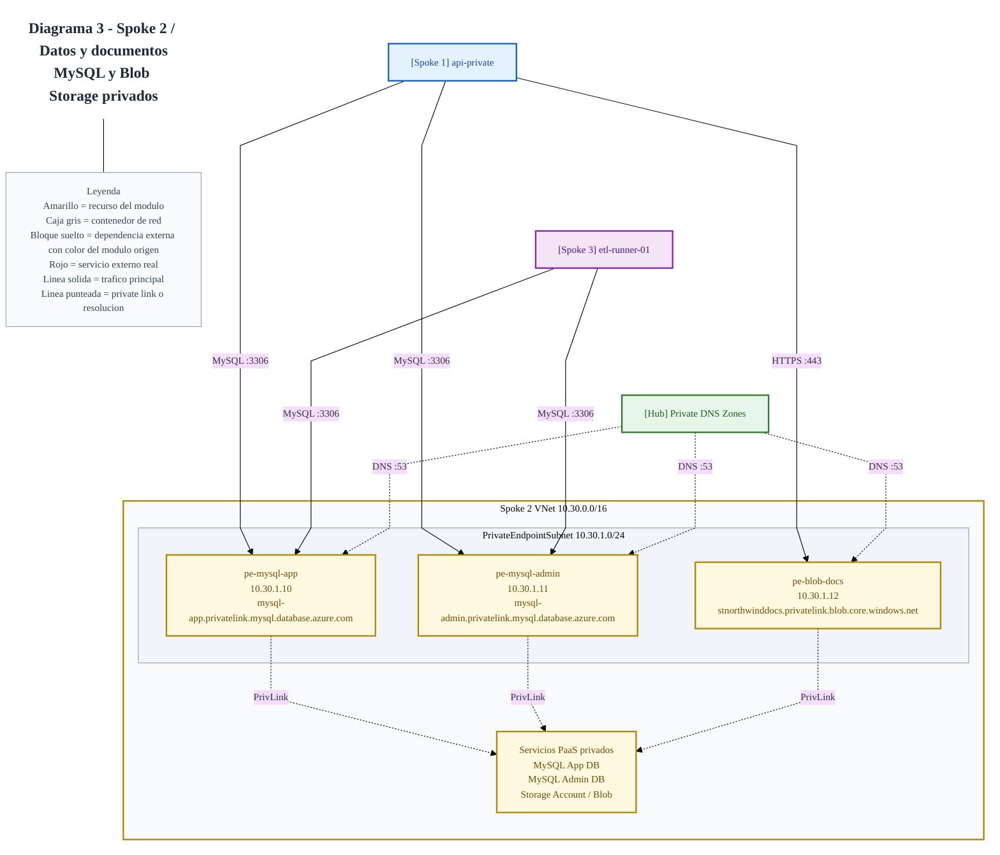
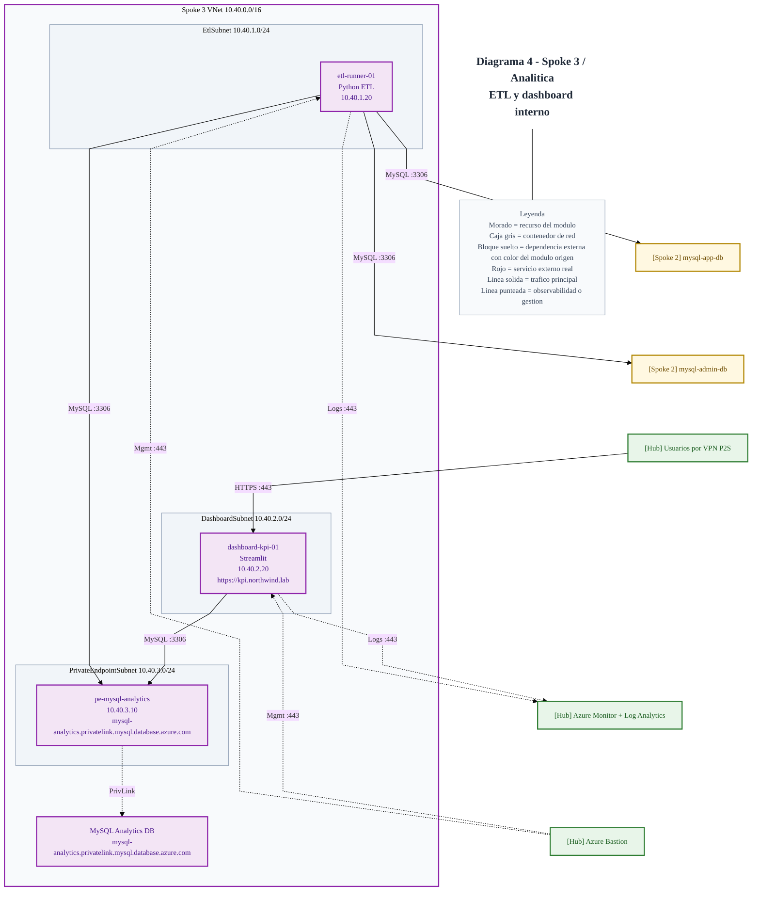

# azure-hubspoke-private-intranet

Private enterprise intranet platform on Azure built with a Hub-and-Spoke architecture, provisioned with Terraform and integrated with Python services, MySQL databases, private storage, analytics, and secure access through Point-to-Site VPN.

## Architecture

The following Mermaid diagrams are embedded from the source files under `docs/arquitectura`.

### General View

Source: [docs/arquitectura/arquitectura-python-mysql.mmd](docs/arquitectura/arquitectura-python-mysql.mmd)

### Hub Module

Source: [docs/arquitectura/hub-vnet-detalle.mmd](docs/arquitectura/hub-vnet-detalle.mmd)

### Spoke 1 - Applications

Source: [docs/arquitectura/spoke1-aplicaciones-detalle.mmd](docs/arquitectura/spoke1-aplicaciones-detalle.mmd)

### Spoke 2 - Data and Documents

Source: [docs/arquitectura/spoke2-datos-detalle.mmd](docs/arquitectura/spoke2-datos-detalle.mmd)

### Spoke 3 - Analytics

Source: [docs/arquitectura/spoke3-analitica-detalle.mmd](docs/arquitectura/spoke3-analitica-detalle.mmd)

### Diagram Sources

- [General view](docs/arquitectura/arquitectura-python-mysql.mmd)
- [Hub module](docs/arquitectura/hub-vnet-detalle.mmd)
- [Spoke 1 - Applications](docs/arquitectura/spoke1-aplicaciones-detalle.mmd)
- [Spoke 2 - Data and documents](docs/arquitectura/spoke2-datos-detalle.mmd)
- [Spoke 3 - Analytics](docs/arquitectura/spoke3-analitica-detalle.mmd)
- [Diagram guide](docs/arquitectura/diagramas-jerarquicos.md)
