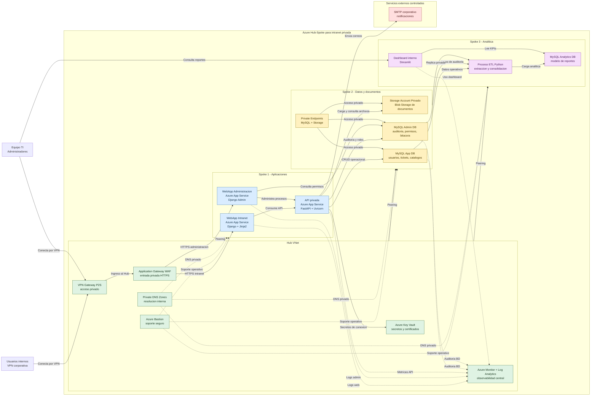

# azure-hubspoke-private-intranet

Private enterprise intranet platform on Azure built with a Hub-and-Spoke architecture, provisioned with Terraform and integrated with Python services, MySQL databases, private storage, analytics, and secure access through Point-to-Site VPN.

## Architecture

