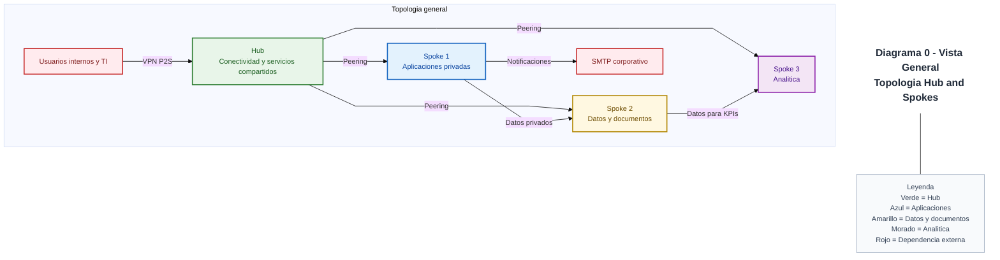
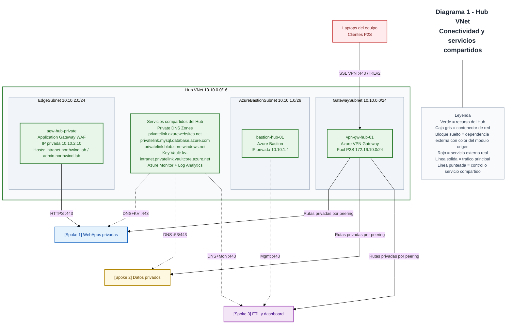
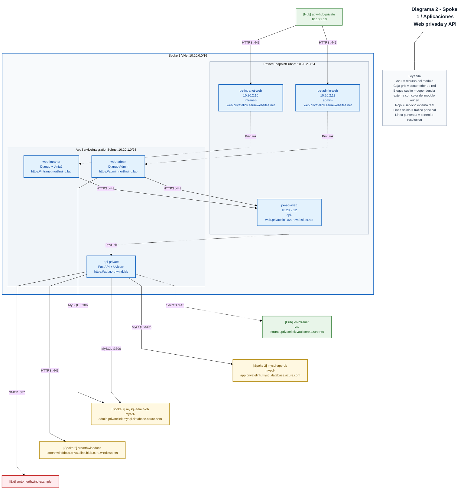
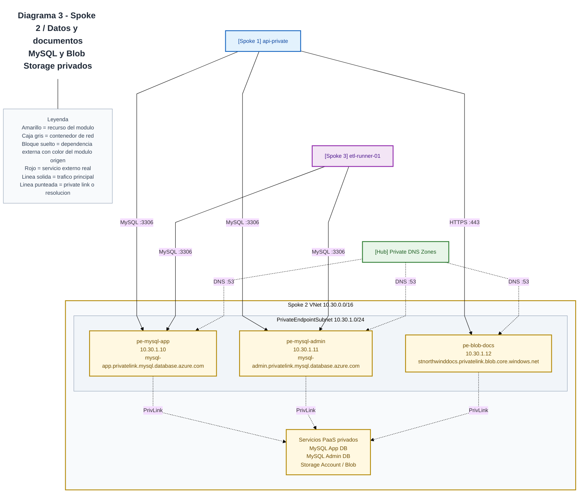
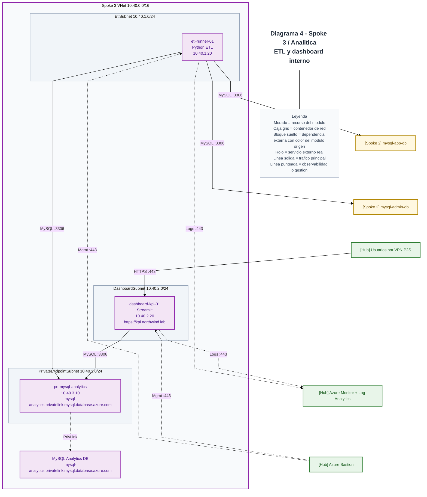

# azure-hubspoke-private-intranet

Private enterprise intranet platform on Azure built with a Hub-and-Spoke architecture, provisioned with Terraform and integrated with Python services, MySQL databases, private storage, analytics, and secure access through Point-to-Site VPN.

## Quickstart

Si te integras por primera vez al proyecto, usa esta guia rapida antes del despliegue detallado:

- [docs/quickstart.md](docs/quickstart.md)

## Despliegue Completo

Ejecutar los comandos desde la raiz del repositorio. El flujo recomendado ahora es usar un solo script orquestador que construye los paquetes de Spoke 1, ejecuta Terraform en orden, valida la infraestructura desde la jumpbox y, solo si no hay `FAIL`, puebla MySQL y carga imagenes en Blob Storage privado.

### 1. Prerrequisitos Locales

Instalar y autenticar las herramientas necesarias:

```bash
az login
az account show --output table
terraform version
jq --version
```

Si tienes varias suscripciones, selecciona la correcta:

```bash
az account set --subscription "<SUBSCRIPTION_ID>"
```

### 2. Configurar Variables

Copia el archivo de ejemplo y ajusta los valores reales. No subas `terraform/main.tfvars` al repositorio si contiene secretos.

```bash
cp terraform/main.tfvars.example terraform/main.tfvars
code terraform/main.tfvars
```

Valores que debes revisar antes del despliegue:

- `location`
- `resource_group_name`
- `project_slug`, `environment` y `unique_suffix`
- `mysql_administrator_password`
- `vm_admin_ssh_public_key`
- `jumpbox_admin_password`
- `hub.vpn_root_certificate_data`, solo si habilitas VPN P2S

### 3. Configurar State Remoto Compartido

Para trabajar varias personas sobre la misma infraestructura, el estado ya no debe quedarse local. El repositorio ahora incluye backend remoto `azurerm` y un script para crear la Storage Account del state y escribir `terraform/backend.hcl`.

```bash
chmod +x scripts/bootstrap-tfstate-backend.sh
./scripts/bootstrap-tfstate-backend.sh
terraform -chdir=terraform init -migrate-state -backend-config="backend.hcl"
```

Si es una maquina nueva y el state ya fue migrado antes, reconfigura Terraform sin volver a mover el state:

```bash
terraform -chdir=terraform init -reconfigure -backend-config="backend.hcl"
```

`terraform/backend.hcl` esta ignorado por Git. Puedes partir de `terraform/backend.hcl.example` si prefieres crear el archivo manualmente.

#### 3.1 Estado Actual Para Trabajo Colaborativo

Con la configuracion actual, el proyecto ya esta listo para ser operado por varios colaboradores sobre la misma infraestructura, siempre que todos usen el mismo backend remoto y no vuelvan a trabajar con state local.

Esto significa lo siguiente:

- El state compartido vive en Azure Blob Storage mediante el backend `azurerm`.
- `terraform plan` y `terraform apply` ahora esperan el lock del state remoto en vez de desactivarlo.
- El archivo `terraform/backend.hcl` se queda local en cada maquina y no debe subirse al repositorio.

#### 3.2 Flujo Para Un Colaborador Nuevo

En una maquina nueva, un integrante del equipo debe hacer esto antes de tocar la infraestructura:

```bash
az login
./scripts/bootstrap-tfstate-backend.sh
terraform -chdir=terraform init -reconfigure -backend-config="backend.hcl"
```

Usa `-migrate-state` solo la primera vez que se mueve el state local al backend remoto. Una vez migrado, el resto del equipo debe usar `-reconfigure`.

#### 3.3 Reglas De Operacion En Equipo

- No ejecutar Terraform con `-lock=false`.
- No crear ni mantener un `terraform.tfstate` local como fuente principal.
- No subir `terraform/backend.hcl` ni archivos con secretos.
- Si otra persona esta aplicando cambios, Terraform esperara el lock remoto hasta agotar el timeout configurado.
- Antes de un `apply`, conviene ejecutar `git pull` y volver a correr `terraform plan` para evitar aplicar sobre codigo desactualizado.

### 4. Ejecutar el Script Unico

El script `scripts/deploy-full.sh` orquesta el flujo completo en este orden:

1. Build de ZIPs prebuilt para Spoke 1.
2. `terraform init` con backend remoto.
3. `terraform validate`.
4. `terraform plan` con locking del state.
5. `terraform apply` con locking del state, solo si pasas `--auto-approve`.
6. Diagnosticos desde la jumpbox.
7. Postdeploy de bases de datos.
8. Carga de imagenes al Storage privado de Spoke 2.

Uso recomendado:

```bash
chmod +x scripts/deploy-full.sh
./scripts/deploy-full.sh --backend-config terraform/backend.hcl --auto-approve --db-task reset-demo
```

Modo seguro, solo hasta `plan`:

```bash
./scripts/deploy-full.sh --backend-config terraform/backend.hcl
```

Ejemplos utiles:

```bash
./scripts/deploy-full.sh --backend-config terraform/backend.hcl --plan-file tfplan-lab
./scripts/deploy-full.sh --backend-config terraform/backend.hcl --auto-approve --skip-diagnostics
./scripts/deploy-full.sh --backend-config terraform/backend.hcl --auto-approve --skip-images --db-task all
```

El script se detiene antes de poblar datos si los diagnosticos reportan `FAIL`. Las advertencias conocidas no bloquean el flujo.

### 5. Flujo Manual, Paso a Paso

Si vas a modificar solo la infraestructura y quieres omitir `deploy-full`, este es el flujo recomendado. El build de paquetes de Spoke 1 solo hace falta si tambien cambiaste codigo de las aplicaciones.

#### 5.1 Reconfigurar el backend y verificar el state remoto

```bash
terraform -chdir=terraform init -reconfigure -backend-config="backend.hcl"
terraform -chdir=terraform state list | head
```

El primer comando apunta Terraform al backend remoto compartido. El segundo confirma que tu maquina puede leer el state en Azure Blob Storage.

#### 5.2 Archivos locales que puedes borrar

Con el backend remoto ya activo, puedes borrar sin afectar el state compartido:

- `terraform/terraform.tfstate` y `terraform/terraform.tfstate.*`, si existen de iteraciones anteriores.
- `terraform/tfplan*` y cualquier archivo de plan temporal como `terraform/tfplan-change`.
- `terraform/diagnostics.ps1` y `terraform/diagnostics-output.txt`, porque se regeneran.
- `terraform/.terraform/`, si necesitas reinicializar modulos o providers.
- `terraform/.terraform-build/prebuilt/`, si quieres forzar la regeneracion de paquetes de Spoke 1.

Conviene conservar:

- `terraform/backend.tf`, `terraform/backend.hcl` y `terraform/backend.hcl.example`.
- `terraform/.terraform.lock.hcl`.
- `terraform/main.tfvars` y el codigo Terraform bajo `terraform/`.

#### 5.3 Construir Paquetes de Spoke 1 solo si cambiaste aplicaciones

Los App Services de Spoke 1 usan paquetes ZIP preconstruidos con dependencias Python. Generarlos antes de planear o aplicar Terraform:

```bash
chmod +x scripts/build-spoke1-prebuilts.sh
./scripts/build-spoke1-prebuilts.sh
```

El script deja los artefactos en `terraform/.terraform-build/prebuilt/`.

#### 5.4 Formatear, validar y generar un plan guardado

```bash
terraform -chdir=terraform fmt -recursive
terraform -chdir=terraform validate
terraform -chdir=terraform plan \
    -var-file="main.tfvars" \
    -input=false \
    -lock-timeout=5m \
    -out=tfplan-change
terraform -chdir=terraform show tfplan-change
```

Ese `plan` no cambia nada en Azure. Sirve para calcular los cambios, guardarlos en un archivo local y revisar exactamente eso antes del `apply`. La ventaja de usar `-out=tfplan-change` es que luego aplicas el mismo plan que inspeccionaste, sin recalcularlo entre medio.

#### 5.5 Aplicar la infraestructura

```bash
terraform -chdir=terraform apply \
    -input=false \
    -lock-timeout=5m \
    tfplan-change
```

Tambien puedes aplicar directamente sin plan guardado:

```bash
terraform -chdir=terraform apply -var-file="main.tfvars" -input=false -lock-timeout=5m -auto-approve
```

Cuando trabajen varias personas o el cambio sea sensible, conviene preferir `plan` seguido de `apply` sobre el archivo guardado.

#### 5.6 Verificar outputs y recursos del state

```bash
terraform -chdir=terraform output
terraform -chdir=terraform output -json | jq '{resource_group_name, jumpbox_access, spoke2_mysql_fqdns, internal_urls}'
terraform -chdir=terraform state list | head
```

Si ya no necesitas el plan local, puedes borrarlo al cerrar la iteracion:

```bash
rm -f terraform/tfplan-change
```

#### 5.7 Ejecutar Diagnosticos de Infraestructura

Genera y ejecuta los diagnosticos desde la jumpbox con Azure Run Command:

```bash
terraform -chdir=terraform output -json | jq '{resource_group_name, jumpbox_access}'
az vm run-command invoke \
    -g "$(terraform -chdir=terraform output -raw resource_group_name)" \
    -n "$(terraform -chdir=terraform output -json | jq -r '.jumpbox_access.value.vm_name')" \
    --command-id RunPowerShellScript \
    --scripts @terraform/diagnostics.ps1 \
    --output table
```

#### 5.8 Poblar Bases de Datos Post-Deploy

Las bases MySQL se crean vacias con Terraform. La carga de esquemas y datos demo se ejecuta despues del despliegue desde la jumpbox privada.

```bash
chmod +x scripts/postdeploy-db.sh
./scripts/postdeploy-db.sh all
./scripts/postdeploy-db.sh verify
```

Para reiniciar los datos demo y volver a cargar todo:

```bash
./scripts/postdeploy-db.sh reset-demo
./scripts/postdeploy-db.sh verify
```

Resultado esperado de verificacion:

```text
employees       50
products        10
sales_history   0
```

#### 5.9 Cargar Imagenes al Storage Account Post-Deploy

Las URLs origen se leen desde `src/spoke2/list-images.txt`. El runner manda un script Python a la jumpbox, descarga las imagenes, las sube al contenedor Blob privado y actualiza `products.image_blob` en MySQL.

```bash
chmod +x scripts/postdeploy-storage-images.sh
./scripts/postdeploy-storage-images.sh
```

Resultado esperado:

```text
uploaded_total          10
products_updated        10
verified_blobs          10
products_with_storage_urls      10
```

### 6. Probar URLs Internas

Consulta las URLs internas esperadas:

```bash
terraform -chdir=terraform output internal_urls
```

El acceso a las aplicaciones privadas requiere estar dentro de la red privada, por ejemplo mediante Azure Bastion/jumpbox o VPN P2S si esta habilitada.

### 7. Destruir el Laboratorio

Cuando termines la practica, destruye los recursos para evitar costos:

```bash
chmod +x scripts/destroy-infra.sh
./scripts/destroy-infra.sh --backend-config terraform/backend.hcl --auto-approve --wait
```

El script es idempotente: si no hay recursos pendientes o el Resource Group ya esta en proceso de borrado, termina sin volver a iniciar acciones destructivas. Para revisar el plan antes de aplicar:

```bash
./scripts/destroy-infra.sh --backend-config terraform/backend.hcl
```

## Architecture

The following Mermaid diagrams are embedded from the source files under `docs/arquitectura`.

### General View

Source: [docs/arquitectura/arquitectura-python-mysql.mmd](docs/arquitectura/arquitectura-python-mysql.mmd)


```mermaid
%%{init: {"theme": "base", "flowchart": {"curve": "linear", "nodeSpacing": 40, "rankSpacing": 55}, "themeVariables": {"fontFamily": "Trebuchet MS", "fontSize": "14px"}} }%%
flowchart TB
    title["Diagrama 0 - Vista General\nTopologia Hub and Spokes"]:::title
    legend["Leyenda\nVerde = Hub\nAzul = Aplicaciones\nAmarillo = Datos y documentos\nMorado = Analitica\nRojo = Dependencia externa"]:::legend
    title --- legend

    subgraph topology["Topologia general"]
        direction LR
        users["Usuarios internos y TI"]:::external
        hub["Hub\nConectividad y servicios compartidos"]:::hub
        spoke1["Spoke 1\nAplicaciones privadas"]:::app
        spoke2["Spoke 2\nDatos y documentos"]:::data
        spoke3["Spoke 3\nAnalitica"]:::analytics
        mail["SMTP corporativo"]:::external
    end

    users -->|"VPN P2S"| hub
    hub -->|"Peering"| spoke1
    hub -->|"Peering"| spoke2
    hub -->|"Peering"| spoke3
    spoke1 -->|"Datos privados"| spoke2
    spoke2 -->|"Datos para KPIs"| spoke3
    spoke1 -->|"Notificaciones"| mail

    classDef title fill:#ffffff,stroke:#ffffff,color:#1f2937,font-size:20px,font-weight:bold;
    classDef legend fill:#f8fafc,stroke:#94a3b8,color:#334155;
    classDef hub fill:#e8f5e9,stroke:#2e7d32,color:#1b5e20,stroke-width:2px;
    classDef app fill:#e3f2fd,stroke:#1565c0,color:#0d47a1,stroke-width:2px;
    classDef data fill:#fff8e1,stroke:#b28704,color:#6d4c00,stroke-width:2px;
    classDef analytics fill:#f3e5f5,stroke:#8e24aa,color:#4a148c,stroke-width:2px;
    classDef external fill:#ffebee,stroke:#c62828,color:#7f1d1d,stroke-width:2px;
```

### Hub Module

Source: [docs/arquitectura/hub-vnet-detalle.mmd](docs/arquitectura/hub-vnet-detalle.mmd)


```mermaid
%%{init: {"theme": "base", "flowchart": {"curve": "linear", "nodeSpacing": 50, "rankSpacing": 65}, "themeVariables": {"fontFamily": "Trebuchet MS", "fontSize": "13px"}} }%%
flowchart TB
    title["Diagrama 1 - Hub VNet<br/>Conectividad y servicios compartidos"]:::title
    legend["Leyenda<br/>Verde = recurso del Hub<br/>Caja gris = contenedor de red<br/>Bloque suelto = dependencia externa con color del modulo origen<br/>Rojo = servicio externo real<br/>Linea solida = trafico principal<br/>Linea punteada = control o servicio compartido"]:::legend
    title --- legend

    subgraph hubvnet["Hub VNet 10.10.0.0/16"]
        direction LR
        subgraph gwsubnet["GatewaySubnet 10.10.0.0/24"]
            direction TB
            vpn["vpn-gw-hub-01<br/>Azure VPN Gateway<br/>Pool P2S 172.16.10.0/24"]:::hub
        end

        subgraph bastionsubnet["AzureBastionSubnet 10.10.1.0/26"]
            direction TB
            bastion["bastion-hub-01<br/>Azure Bastion<br/>IP privada 10.10.1.4"]:::hub
        end

        subgraph edgesubnet["EdgeSubnet 10.10.2.0/24"]
            direction TB
            agw["agw-hub-private<br/>Application Gateway WAF<br/>IP privada 10.10.2.10<br/>Hosts: intranet.northwind.lab / admin.northwind.lab"]:::hub
        end

        shared["Servicios compartidos del Hub<br/>Private DNS Zones<br/>privatelink.azurewebsites.net<br/>privatelink.mysql.database.azure.com<br/>privatelink.blob.core.windows.net<br/>Key Vault: kv-intranet.privatelink.vaultcore.azure.net<br/>Azure Monitor + Log Analytics"]:::hub
    end

    laptops["Laptops del equipo<br/>Clientes P2S"]:::external
    spoke1["[Spoke 1] WebApps privadas"]:::app
    spoke2["[Spoke 2] Datos privados"]:::data
    spoke3["[Spoke 3] ETL y dashboard"]:::analytics

    laptops -->|"SSL VPN :443 / IKEv2"| vpn
    vpn -->|"Rutas privadas por peering"| spoke1
    vpn -->|"Rutas privadas por peering"| spoke2
    vpn -->|"Rutas privadas por peering"| spoke3
    agw -->|"HTTPS :443"| spoke1
    shared -.->|"DNS+KV :443"| spoke1
    shared -.->|"DNS :53/443"| spoke2
    shared -.->|"DNS+Mon :443"| spoke3
    bastion -.->|"Mgmt :443"| spoke3

    spoke1 ~~~ spoke2
    spoke2 ~~~ spoke3

    style hubvnet fill:#f8fafc,stroke:#2e7d32,stroke-width:2px;
    style gwsubnet fill:#f1f5f9,stroke:#94a3b8,stroke-width:1px;
    style bastionsubnet fill:#f1f5f9,stroke:#94a3b8,stroke-width:1px;
    style edgesubnet fill:#f1f5f9,stroke:#94a3b8,stroke-width:1px;

    classDef title fill:#ffffff,stroke:#ffffff,color:#1f2937,font-size:20px,font-weight:bold;
    classDef legend fill:#f8fafc,stroke:#94a3b8,color:#334155;
    classDef hub fill:#e8f5e9,stroke:#2e7d32,color:#1b5e20,stroke-width:2px;
    classDef app fill:#e3f2fd,stroke:#1565c0,color:#0d47a1,stroke-width:2px;
    classDef data fill:#fff8e1,stroke:#b28704,color:#6d4c00,stroke-width:2px;
    classDef analytics fill:#f3e5f5,stroke:#8e24aa,color:#4a148c,stroke-width:2px;
    classDef external fill:#ffebee,stroke:#c62828,color:#7f1d1d,stroke-width:2px;
```

### Spoke 1 - Applications

Source: [docs/arquitectura/spoke1-aplicaciones-detalle.mmd](docs/arquitectura/spoke1-aplicaciones-detalle.mmd)


```mermaid
%%{init: {"theme": "base", "flowchart": {"curve": "linear", "nodeSpacing": 52, "rankSpacing": 68}, "themeVariables": {"fontFamily": "Trebuchet MS", "fontSize": "13px"}} }%%
flowchart TB
    title["Diagrama 2 - Spoke 1 / Aplicaciones<br/>Web privada y API"]:::title
    legend["Leyenda<br/>Azul = recurso del modulo<br/>Caja gris = contenedor de red<br/>Bloque suelto = dependencia externa con color del modulo origen<br/>Rojo = servicio externo real<br/>Linea solida = trafico principal<br/>Linea punteada = control o resolucion"]:::legend
    title --- legend

    subgraph spoke1["Spoke 1 VNet 10.20.0.0/16"]
        direction LR
        subgraph appsubnet["AppServiceIntegrationSubnet 10.20.1.0/24"]
            direction TB
            portal["web-intranet<br/>Django + Jinja2<br/>https://intranet.northwind.lab"]:::app
            adminapp["web-admin<br/>Django Admin<br/>https://admin.northwind.lab"]:::app
            api["api-private<br/>FastAPI + Uvicorn<br/>https://api.northwind.lab"]:::app
        end

        subgraph pesubnet["PrivateEndpointSubnet 10.20.2.0/24"]
            direction TB
            peportal["pe-intranet-web<br/>10.20.2.10<br/>intranet-web.privatelink.azurewebsites.net"]:::app
            peadmin["pe-admin-web<br/>10.20.2.11<br/>admin-web.privatelink.azurewebsites.net"]:::app
            peapi["pe-api-web<br/>10.20.2.12<br/>api-web.privatelink.azurewebsites.net"]:::app
        end
    end

    agw["[Hub] agw-hub-private<br/>10.10.2.10"]:::hub
    kv["[Hub] kv-intranet<br/>kv-intranet.privatelink.vaultcore.azure.net"]:::hub
    dbapp["[Spoke 2] mysql-app-db<br/>mysql-app.privatelink.mysql.database.azure.com"]:::data
    dbadmin["[Spoke 2] mysql-admin-db<br/>mysql-admin.privatelink.mysql.database.azure.com"]:::data
    blob["[Spoke 2] stnorthwinddocs<br/>stnorthwinddocs.privatelink.blob.core.windows.net"]:::data
    smtp["[Ext] smtp.northwind.example"]:::external

    agw -->|"HTTPS :443"| peportal
    agw -->|"HTTPS :443"| peadmin
    peportal -.->|"PrivLink"| portal
    peadmin -.->|"PrivLink"| adminapp
    peapi -.->|"PrivLink"| api
    portal -->|"HTTPS :443"| peapi
    adminapp -->|"HTTPS :443"| peapi
    api -->|"MySQL :3306"| dbapp
    adminapp -->|"MySQL :3306"| dbadmin
    api -->|"MySQL :3306"| dbadmin
    api -->|"HTTPS :443"| blob
    api -.->|"Secrets :443"| kv
    api -->|"SMTP :587"| smtp

    agw ~~~ kv
    kv ~~~ dbapp
    dbapp ~~~ dbadmin
    dbadmin ~~~ blob
    blob ~~~ smtp

    style spoke1 fill:#f8fafc,stroke:#1565c0,stroke-width:2px;
    style appsubnet fill:#f1f5f9,stroke:#94a3b8,stroke-width:1px;
    style pesubnet fill:#f1f5f9,stroke:#94a3b8,stroke-width:1px;

    classDef title fill:#ffffff,stroke:#ffffff,color:#1f2937,font-size:20px,font-weight:bold;
    classDef legend fill:#f8fafc,stroke:#94a3b8,color:#334155;
    classDef hub fill:#e8f5e9,stroke:#2e7d32,color:#1b5e20,stroke-width:2px;
    classDef app fill:#e3f2fd,stroke:#1565c0,color:#0d47a1,stroke-width:2px;
    classDef data fill:#fff8e1,stroke:#b28704,color:#6d4c00,stroke-width:2px;
    classDef analytics fill:#f3e5f5,stroke:#8e24aa,color:#4a148c,stroke-width:2px;
    classDef external fill:#ffebee,stroke:#c62828,color:#7f1d1d,stroke-width:2px;
```

### Spoke 2 - Data and Documents

Source: [docs/arquitectura/spoke2-datos-detalle.mmd](docs/arquitectura/spoke2-datos-detalle.mmd)


```mermaid
%%{init: {"theme": "base", "flowchart": {"curve": "linear", "nodeSpacing": 55, "rankSpacing": 72}, "themeVariables": {"fontFamily": "Trebuchet MS", "fontSize": "13px"}} }%%
flowchart TB
    title["Diagrama 3 - Spoke 2 / Datos y documentos<br/>MySQL y Blob Storage privados"]:::title
    legend["Leyenda<br/>Amarillo = recurso del modulo<br/>Caja gris = contenedor de red<br/>Bloque suelto = dependencia externa con color del modulo origen<br/>Rojo = servicio externo real<br/>Linea solida = trafico principal<br/>Linea punteada = private link o resolucion"]:::legend
    title --- legend

    subgraph spoke2["Spoke 2 VNet 10.30.0.0/16"]
        direction LR
        subgraph pesubnet["PrivateEndpointSubnet 10.30.1.0/24"]
            direction TB
            pemysqlapp["pe-mysql-app<br/>10.30.1.10<br/>mysql-app.privatelink.mysql.database.azure.com"]:::data
            pemysqladmin["pe-mysql-admin<br/>10.30.1.11<br/>mysql-admin.privatelink.mysql.database.azure.com"]:::data
            peblob["pe-blob-docs<br/>10.30.1.12<br/>stnorthwinddocs.privatelink.blob.core.windows.net"]:::data
        end

        dataservices["Servicios PaaS privados<br/>MySQL App DB<br/>MySQL Admin DB<br/>Storage Account / Blob"]:::data
    end

    api["[Spoke 1] api-private"]:::app
    etl["[Spoke 3] etl-runner-01"]:::analytics
    dns["[Hub] Private DNS Zones"]:::hub

    api -->|"MySQL :3306"| pemysqlapp
    api -->|"MySQL :3306"| pemysqladmin
    api -->|"HTTPS :443"| peblob
    etl -->|"MySQL :3306"| pemysqlapp
    etl -->|"MySQL :3306"| pemysqladmin
    pemysqlapp -.->|"PrivLink"| dataservices
    pemysqladmin -.->|"PrivLink"| dataservices
    peblob -.->|"PrivLink"| dataservices
    dns -.->|"DNS :53"| pemysqlapp
    dns -.->|"DNS :53"| pemysqladmin
    dns -.->|"DNS :53"| peblob

    api ~~~ etl
    etl ~~~ dns

    style spoke2 fill:#f8fafc,stroke:#b28704,stroke-width:2px;
    style pesubnet fill:#f1f5f9,stroke:#94a3b8,stroke-width:1px;

    classDef title fill:#ffffff,stroke:#ffffff,color:#1f2937,font-size:20px,font-weight:bold;
    classDef legend fill:#f8fafc,stroke:#94a3b8,color:#334155;
    classDef hub fill:#e8f5e9,stroke:#2e7d32,color:#1b5e20,stroke-width:2px;
    classDef app fill:#e3f2fd,stroke:#1565c0,color:#0d47a1,stroke-width:2px;
    classDef data fill:#fff8e1,stroke:#b28704,color:#6d4c00,stroke-width:2px;
    classDef analytics fill:#f3e5f5,stroke:#8e24aa,color:#4a148c,stroke-width:2px;
    classDef external fill:#ffebee,stroke:#c62828,color:#7f1d1d,stroke-width:2px;
```

### Spoke 3 - Analytics

Source: [docs/arquitectura/spoke3-analitica-detalle.mmd](docs/arquitectura/spoke3-analitica-detalle.mmd)


```mermaid
%%{init: {"theme": "base", "flowchart": {"curve": "linear", "nodeSpacing": 55, "rankSpacing": 72}, "themeVariables": {"fontFamily": "Trebuchet MS", "fontSize": "13px"}} }%%
flowchart TB
    title["Diagrama 4 - Spoke 3 / Analitica<br/>ETL y dashboard interno"]:::title
    legend["Leyenda<br/>Morado = recurso del modulo<br/>Caja gris = contenedor de red<br/>Bloque suelto = dependencia externa con color del modulo origen<br/>Rojo = servicio externo real<br/>Linea solida = trafico principal<br/>Linea punteada = observabilidad o gestion"]:::legend
    title --- legend

    subgraph spoke3["Spoke 3 VNet 10.40.0.0/16"]
        direction LR
        subgraph etlsubnet["EtlSubnet 10.40.1.0/24"]
            direction TB
            etl["etl-runner-01<br/>Python ETL<br/>10.40.1.20"]:::analytics
        end

        subgraph dashboardsubnet["DashboardSubnet 10.40.2.0/24"]
            direction TB
            dashboard["dashboard-kpi-01<br/>Streamlit<br/>10.40.2.20<br/>https://kpi.northwind.lab"]:::analytics
        end

        subgraph pesubnet["PrivateEndpointSubnet 10.40.3.0/24"]
            direction TB
            peanalytics["pe-mysql-analytics<br/>10.40.3.10<br/>mysql-analytics.privatelink.mysql.database.azure.com"]:::analytics
        end

        analyticsdb["MySQL Analytics DB<br/>mysql-analytics.privatelink.mysql.database.azure.com"]:::analytics
    end

    dbapp["[Spoke 2] mysql-app-db"]:::data
    dbadmin["[Spoke 2] mysql-admin-db"]:::data
    vpnusers["[Hub] Usuarios por VPN P2S"]:::hub
    monitor["[Hub] Azure Monitor + Log Analytics"]:::hub
    bastion["[Hub] Azure Bastion"]:::hub

    etl -->|"MySQL :3306"| dbapp
    etl -->|"MySQL :3306"| dbadmin
    etl -->|"MySQL :3306"| peanalytics
    peanalytics -.->|"PrivLink"| analyticsdb
    dashboard -->|"MySQL :3306"| peanalytics
    vpnusers -->|"HTTPS :443"| dashboard
    etl -.->|"Logs :443"| monitor
    dashboard -.->|"Logs :443"| monitor
    bastion -.->|"Mgmt :443"| etl
    bastion -.->|"Mgmt :443"| dashboard

    dbapp ~~~ dbadmin
    dbadmin ~~~ vpnusers
    vpnusers ~~~ monitor
    monitor ~~~ bastion

    style spoke3 fill:#f8fafc,stroke:#8e24aa,stroke-width:2px;
    style etlsubnet fill:#f1f5f9,stroke:#94a3b8,stroke-width:1px;
    style dashboardsubnet fill:#f1f5f9,stroke:#94a3b8,stroke-width:1px;
    style pesubnet fill:#f1f5f9,stroke:#94a3b8,stroke-width:1px;

    classDef title fill:#ffffff,stroke:#ffffff,color:#1f2937,font-size:20px,font-weight:bold;
    classDef legend fill:#f8fafc,stroke:#94a3b8,color:#334155;
    classDef hub fill:#e8f5e9,stroke:#2e7d32,color:#1b5e20,stroke-width:2px;
    classDef app fill:#e3f2fd,stroke:#1565c0,color:#0d47a1,stroke-width:2px;
    classDef data fill:#fff8e1,stroke:#b28704,color:#6d4c00,stroke-width:2px;
    classDef analytics fill:#f3e5f5,stroke:#8e24aa,color:#4a148c,stroke-width:2px;
    classDef external fill:#ffebee,stroke:#c62828,color:#7f1d1d,stroke-width:2px;
```

### Diagram Sources

- [General view](docs/arquitectura/arquitectura-python-mysql.mmd)
- [Hub module](docs/arquitectura/hub-vnet-detalle.mmd)
- [Spoke 1 - Applications](docs/arquitectura/spoke1-aplicaciones-detalle.mmd)
- [Spoke 2 - Data and documents](docs/arquitectura/spoke2-datos-detalle.mmd)
- [Spoke 3 - Analytics](docs/arquitectura/spoke3-analitica-detalle.mmd)
- [Diagram guide](docs/arquitectura/diagramas-jerarquicos.md)

## Team

Practica final de arquitectura cloud privada en Azure · UNAM 2026

| | | |
| :---: | :---: | :---: |
|  |  |  |
| **[Erick Aguilar](https://github.com/Eickyair)** | **Carlos E. Mendoza H.** | **[Alan Magno](https://github.com/alanmagno1)** |
| Cloud Infrastructure Engineer | Full Stack Developer | Network Security |
| Arquitectura Terraform Hub-Spoke, despliegue orquestado, diagnosticos y postdeploy | APIs FastAPI, frontend glassmorphism, schemas MySQL, integracion Blob Storage | VPN Point-to-Site, Azure VPN Gateway y autenticacion PKI |
| `Terraform` `Azure` `IaC` `Bash` `Python` | `FastAPI` `Jinja2` `MySQL` `HTML/CSS` | `VPN P2S` `PKI` `Terraform` |
