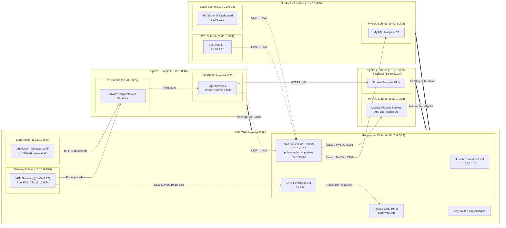

# MEMORIA TÉCNICA
## Implementación de Arquitectura Hub-and-Spoke Segura en Azure con Acceso Privado VPN Point-to-Site

**Materia:** Cómputo en la nube con Azure  
**Institución:** Universidad Nacional Autónoma de México (UNAM)  
**Fecha:** 25 de mayo de 2026  
**Ambiente:** Laboratorio (`lab`)  
**Región:** Mexico Central (`mexicocentral`)  

---

### Control de Versiones y Autores

| Versión | Fecha | Descripción | Autores |
| --- | --- | --- | --- |
| 1.0 | 25/05/2026 | Versión inicial de la memoria técnica del proyecto. | Erick Aguilar, Carlos E. Mendoza H., Alan Magno |
| 1.1 | 29/05/2026 | Migración de peerings directos inter-spoke a topología Hub-and-Spoke pura con NVA de tránsito y tablas de ruta (UDR); resolución de carrera de propagación RBAC en Key Vault; automatización de certificados e importación de recursos en el script de despliegue; actualización del modelo de costos. | Erick Aguilar, Carlos E. Mendoza H., Alan Magno |

### Perfil del Equipo de Trabajo

*   **Erick Aguilar** (*Cloud Infrastructure Engineer*): Diseño de arquitectura Terraform Hub-Spoke, automatización y despliegue orquestado de infraestructura, diagnóstico de red y script de postdeploy.
*   **Carlos E. Mendoza H.** (*Full Stack Developer*): Desarrollo de APIs y WebApps con FastAPI y Jinja2, diseño de esquemas de bases de datos operativas en MySQL e integración con Azure Blob Storage.
*   **Alan Magno** (*Network Security*): Configuración de conectividad VPN Point-to-Site, diseño de políticas de Network Security Groups (NSGs) y seguridad perimetral de red.

---

## 1. Resumen Ejecutivo y Objetivos

El presente documento detalla el diseño, la implementación y la estimación financiera de una plataforma de intranet corporativa privada para la empresa ficticia Northwind Distribución desplegada en Azure. 

### 1.1 Objetivo General
Diseñar e implementar una infraestructura segura basada en el patrón de arquitectura Hub-and-Spoke en Azure. La solución garantiza que todos los recursos de computación (App Services, Máquinas Virtuales), almacenamiento (Blob Storage) y bases de datos (MySQL Flexible Server) permanezcan completamente aislados de internet (exposición pública cero). El acceso administrativo y de usuario se realiza exclusivamente mediante una conexión cifrada VPN Point-to-Site (P2S) y consolas seguras de Azure Bastion.

### 1.2 Objetivos Específicos
*   **Aislamiento Total de Red:** Restringir el acceso público a las aplicaciones Web, APIs y bases de datos a través de subredes dedicadas, delegadas e integración con Private Endpoints.
*   **Conectividad Híbrida Segura:** Configurar una VPN Point-to-Site en el Hub VNet mediante el protocolo OpenVPN y autenticación por certificados SSL/TLS auto-firmados.
*   **Resolución de Nombres Privados:** Resolver de manera transparente los dominios corporativos (`*.northwind.lab`) y endpoints privados de Azure desde los equipos de los usuarios de la VPN.
*   **Gobernanza y Control Financiero:** Establecer una política estricta de nomenclatura y etiquetado (*tagging*) de recursos en Azure, y realizar una proyección financiera a 3 años evaluando esquemas de pago por uso (PAYG), auto-apagado 8x5 e instancias reservadas (RI).

---

## 2. Arquitectura de Red y Direccionamiento IP

La topología de red se estructura en un Hub VNet central que actúa como concentrador de servicios de conectividad, y tres Spokes VNets dedicados a aislar lógicamente las diferentes capas de la aplicación corporativa (Aplicaciones, Datos y Analítica).

### 2.1 Tabla de Direccionamiento IP y Subredes

| Red Virtual (VNet) | Subred (Subnet) | Rango CIDR | Propósito / Servicios |
| --- | --- | --- | --- |
| **Hub VNet** `10.10.0.0/16` | `GatewaySubnet` | `10.10.0.0/24` | Gateway de VPN P2S (`vpngw-privintra-lab-001-hub`) |
| | `AzureBastionSubnet` | `10.10.1.0/26` | Host de Bastion para administración segura |
| | `snet-privintra-hub-edge` | `10.10.2.0/24` | Application Gateway WAF (`10.10.2.10`) |
| | `snet-privintra-hub-pe` | `10.10.3.0/24` | Private Endpoints compartidos (Key Vault) |
| | `snet-privintra-hub-mgmt`| `10.10.4.0/24` | Jumpbox Windows (`10.10.4.10`), DNS Forwarder (`10.10.4.50`) y NVA de tránsito inter-spoke (`10.10.4.100`) |
| **Spoke 1 (Apps)** `10.20.0.0/16`| `snet-spoke1-appsvc` | `10.20.1.0/24` | Integración de red para App Services (Intranet, Admin, APIs) |
| | `snet-spoke1-pe` | `10.20.2.0/24` | Private Endpoints para acceso privado a las WebApps |
| **Spoke 2 (Datos)** `10.30.0.0/16`| `snet-spoke2-mysql` | `10.30.1.0/24` | Subred delegada para Azure Database for MySQL Flexible Servers |
| | `snet-spoke2-pe` | `10.30.2.0/24` | Private Endpoint para Storage Account (`Blob`) |
| **Spoke 3 (Analítica)** `10.40.0.0/16`| `snet-spoke3-etl` | `10.40.1.0/24` | Máquina virtual privada para el proceso de ETL |
| | `snet-spoke3-dash` | `10.40.2.0/24` | Máquina virtual privada para el Dashboard (Streamlit) |
| | `snet-spoke3-mysql` | `10.40.3.0/24` | Subred delegada para MySQL Analytics Server |
| **VPN Clients** | Pool de Direcciones P2S | `172.16.10.0/24`| Direcciones IPs dinámicas asignadas a clientes OpenVPN conectados |

### 2.2 Diagrama de Topología de Red Consolidada

El siguiente diagrama detalla cómo interactúan los componentes del Hub y de los tres Spokes a nivel de red y resolución DNS:

### 2.3 Peerings y Flujos de Tráfico
*   **Peerings Hub-Spoke:** Se crearon enlaces de VNet Peering entre el Hub y los Spokes 1, 2 y 3. El peering desde el Hub tiene habilitada la opción de *Gateway Transit*, permitiendo que las redes de los Spokes utilicen el VPN Gateway del Hub para comunicarse de vuelta hacia los clientes VPN (*Use Remote Gateways*). **No existen peerings directos entre Spokes:** toda la comunicación inter-spoke transita obligatoriamente por el Hub, respetando la topología Hub-and-Spoke pura.
*   **Tránsito Inter-Spoke vía Hub-Transit NVA:** Como Azure no enruta tráfico entre spokes a través de un peering Hub-Spoke por sí solo, se desplegó una NVA (*Network Virtual Appliance*) Linux en la subred de administración del Hub (`10.10.4.100`) que actúa como punto de reenvío L3:
    *   La NVA tiene `ip_forwarding_enabled = true` en su NIC y aplica `iptables -P FORWARD ACCEPT` (habilitado de forma persistente vía `sysctl net.ipv4.ip_forward = 1` y una tarea `cron @reboot`), inicializada con `custom_data` de cloud-init.
    *   En cada Spoke se asociaron **tablas de ruta definidas por el usuario (UDR)** a las subredes que originan tráfico inter-spoke (integración de App Services en Spoke 1, subred delegada de MySQL en Spoke 2, y subredes de ETL y Dashboard en Spoke 3). Cada ruta apunta los CIDR de los spokes remotos con `next_hop_type = "VirtualAppliance"` hacia la IP de la NVA.
    *   El flujo resultante es: `Spoke origen → (UDR) → NVA del Hub → (forward) → Spoke destino`. Por ejemplo, las APIs de Spoke 1 alcanzan MySQL en Spoke 2, y el ETL de Spoke 3 extrae datos de Spoke 2, siempre transitando por la NVA.
    *   *Razón de diseño:* Esta migración (commit `8db3127`) reemplazó los cuatro peerings directos inter-spoke previos por una topología Hub-and-Spoke canónica. Concentrar el tráfico inter-spoke en una NVA del Hub centraliza el control de enrutamiento y permite, a futuro, insertar inspección, registro o filtrado L4/L7 en un único punto, a un costo de cómputo mínimo frente a un Azure Firewall administrado.

---

## 3. Servicios Implementados por Módulo

### 3.1 Hub VNet (Servicios Compartidos)
*   **Azure VPN Gateway P2S (`VpnGw1AZ`):** Permite el acceso de los clientes locales autenticados mediante certificados.
*   **Azure Bastion (SKU Standard):** Habilita la administración segura por consola web (RDP/SSH) de la Jumpbox y de las VMs del Spoke 3 sin exponer IPs públicas.
*   **Application Gateway WAF_v2 (`10.10.2.10`):** WAF en modo de prevención para la protección contra ataques web OWASP 3.2. Centraliza y balancea de forma privada el tráfico HTTPS hacia los App Services.
*   **Azure Key Vault:** Centraliza secretos (contraseñas de MySQL, llaves de Storage y certificados PFX de HTTPS) protegiéndolos mediante políticas de acceso RBAC.
*   **Jumpbox Windows Server VM (`Standard_B4s_v2`):** Actúa como entorno de pruebas y diagnóstico de la red interna.
*   **DNS Forwarder VM (`10.10.4.50`):** Máquina Linux ejecutando `dnsmasq` configurada para resolver peticiones DNS privadas a clientes conectados por VPN.
*   **NVA de Tránsito Inter-Spoke (`vm-privintra-lab-001-nva-01`, `10.10.4.100`):** Máquina virtual Linux (`Standard_B4s_v2`, Ubuntu 22.04) que reenvía a nivel de red el tráfico entre los Spokes. Tiene `ip_forwarding_enabled` en su NIC y reglas `iptables FORWARD ACCEPT` persistentes; es el *next-hop* (`VirtualAppliance`) de las tablas de ruta UDR de los tres Spokes. Su contraseña de administrador se genera dinámicamente con `random_password` (sin credenciales en el código). Está protegida por un NSG dedicado que solo admite tránsito desde el espacio `10.0.0.0/8` y deniega el resto del tráfico entrante.
*   **Log Analytics Workspace (`law-privintra-lab-001-shared`):** Espacio de trabajo centralizado para la recolección de métricas, logs de diagnóstico y telemetría de los recursos del proyecto. Configurado con retención de 30 días y SKU `PerGB2018`.

### 3.2 Spoke 1 (Aplicaciones)
*   **WebApp Intranet:** Azure App Service (Python/FastAPI + Jinja2) utilizado por los empleados generales para consultar catálogos.
*   **WebApp Administración:** Azure App Service (FastAPI + Jinja2) para la gestión operativa.
*   **APIs Privadas (FastAPI):** Dos App Services independientes que exponen la lógica de negocio desacoplada de la base de datos para el Catálogo (`api`) y la Administración (`admin-api`).
*   **Private Endpoints:** Cuatro endpoints privados integrados en la subred de endpoints del Spoke 1, inhabilitando el acceso web por sus FQDNs públicos de Azure (`*.azurewebsites.net`).
*   **Storage Account de Paquetes (`stpkg...`):** Cuenta de almacenamiento auxiliar que aloja los paquetes ZIP precompilados de cada aplicación. Los App Services descargan estos paquetes al arrancar mediante URLs con token SAS de solo lectura, permitiendo despliegues reproducibles sin necesidad de un pipeline de CI/CD externo.

### 3.3 Spoke 2 (Datos y Documentos)
*   **MySQL App DB & MySQL Admin DB:** Dos servidores independientes en Azure Database for MySQL Flexible Server (`B_Standard_B1ms`) aislados en su subred delegada (`10.30.1.0/24`). El primero almacena los datos del catálogo de productos y el segundo los datos de gestión administrativa.
*   **Storage Account Privado (`Blob`):** Almacena imágenes de productos y reportes. Sin endpoints públicos activos. Se accede mediante un Private Endpoint en la IP `10.30.2.X`.

### 3.4 Spoke 3 (Analítica)
*   **VM Linux ETL (`Standard_B2ls_v2`):** Proceso programado en Python que extrae periódicamente los datos transaccionales desde el Spoke 2, los transforma y los escribe en la base de datos analítica. La VM se aprovisiona automáticamente mediante un template de cloud-init que instala dependencias, despliega el código fuente y registra el servicio como unidad de `systemd`.
*   **MySQL Analytics DB:** Servidor de base de datos dedicada a KPIs analíticos para evitar degradar el rendimiento transaccional de las bases del Spoke 2.
*   **Dashboard Streamlit VM (`Standard_B2ls_v2`):** Expone un portal web interactivo en el puerto `8501`, el cual se publica a través del Application Gateway del Hub bajo el dominio `kpi.northwind.lab`. Al igual que la VM de ETL, se inicializa con cloud-init que configura el entorno y levanta Streamlit como servicio persistente.

---

## 4. Acceso Privado y VPN Point-to-Site (P2S)

La conectividad de los desarrolladores y personal de TI con la infraestructura de Azure se realiza a través de una VPN Point-to-Site.

### 4.1 Configuración de VPN Gateway
*   **Protocolo:** OpenVPN (puerto TCP/UDP 443).
*   **Autenticación:** Certificados X.509 de cliente firmados por la CA Raíz Privada del proyecto.
*   **SKU de VPN:** `VpnGw1AZ` (SKU con redundancia de zona que garantiza un SLA del 99.95% y mejor throughput frente al básico).

### 4.2 La Solución DNS: DNS Forwarder VM con `dnsmasq`
*   **El Problema:** Cuando un cliente VPN local se conecta a Azure, recibe direcciones IP dentro del rango `172.16.10.0/24`. Sin embargo, los servidores de DNS públicos no conocen los registros de las Azure Private DNS Zones (como `privatelink.azurewebsites.net` o `northwind.lab`). Al mismo tiempo, la IP del resolvedor de Azure (`168.63.129.16`) solo responde a peticiones originadas *dentro* de las VNets de Azure, por lo que el cliente VPN no puede hacer consultas DNS directas a dicha IP.
*   **La Solución:** 
    1. Se desplegó una máquina virtual Linux ligera (`vm-dns-forwarder-01`) en la subred de administración del Hub con la IP estática `10.10.4.50`.
    2. Se instaló y configuró `dnsmasq` para que acepte consultas DNS entrantes en el puerto 53 desde el rango de red de la VPN (`172.16.10.0/24`) y las reenvíe al resolvedor interno de Azure `168.63.129.16`.
    3. Se configuró el DNS de la Hub VNet en Terraform para apuntar a `10.10.4.50`.
    4. Al establecer la conexión VPN, el Gateway hereda automáticamente el servidor DNS de la VNet (`10.10.4.50`) al cliente. De esta forma, el cliente local resuelve de forma transparente URLs privadas como `intranet.northwind.lab` traduciéndolas a la IP privada del Application Gateway (`10.10.2.10`).

---

## 5. Seguridad y Exposición Pública Cero

La seguridad es el pilar fundamental del diseño de Northwind Distribución. Se han mitigado todos los vectores de ataque externos:

### 5.1 Aplicaciones Web Privadas
Los App Services tienen desactivado el acceso desde redes públicas (`public_network_access_enabled = false`). Su tráfico se enruta de la siguiente forma:
1. El usuario se conecta a la VPN.
2. Abre en su navegador `https://intranet.northwind.lab`.
3. El DNS Forwarder resuelve este dominio a la IP del Application Gateway WAF (`10.10.2.10`).
4. El Application Gateway (con SSL certificado) valida la petición y la reenvía de forma segura al Private Endpoint de la WebApp correspondiente (`10.20.2.4` o `10.20.2.5`).

### 5.2 Bases de Datos y Almacenamiento Privados
*   **MySQL Flexible Servers:** No cuentan con direcciones IPs públicas asignadas. Su integración se realiza mediante inyección directa a la subred delegada (`10.30.1.0/24`). Solo aceptan tráfico en el puerto `3306` originado desde las subredes autorizadas (Spoke 1 para APIs, Spoke 3 para ETL y Dashboard, y la subred de administración del Hub para la Jumpbox) mediante reglas NSG estrictas.
*   **Blob Storage:** El cortafuegos de la cuenta de almacenamiento tiene denegado el acceso general de internet. Se configuró un Private Endpoint en la subred `10.30.2.0/24`. Las APIs consumen este recurso internamente de forma cifrada a través de la red privada de Azure.

### 5.3 Integración de Secretos con Azure Key Vault
Para evitar la fuga de secretos o credenciales comprometidas en repositorios de código:
1. Las contraseñas de administración de bases de datos, las llaves maestras de almacenamiento y el certificado PFX de HTTPS se crearon como secretos en Key Vault (`azurerm_key_vault_secret`).
2. Se habilitaron System Assigned Managed Identities en todos los App Services (Intranet, Admin y APIs).
3. Se crearon asignaciones de roles RBAC en Azure (Key Vault Secrets User) para las identidades de las aplicaciones sobre el Key Vault.
4. En las configuraciones de App Settings de los App Services, las contraseñas se referencian mediante sintaxis nativa:  
   `MYSQL_APP_PASSWORD = @Microsoft.KeyVault(VaultName=kv-privintra-lab;SecretName=mysql-administrator-password)`
   *El App Service recupera el secreto en tiempo de ejecución en memoria, sin revelar la contraseña en texto plano en la consola de Azure.*

---

## 6. Gobierno de Recursos: Nomenclatura y Tags

### 6.1 Taxonomía de Nombres de Recursos
Todos los recursos siguen una estructura consistente de nomenclatura para facilitar su auditoría y automatización:  
`<tipo-recurso>-<nombre-proyecto>-<ambiente>-<sufijo>-<modulo/función>`

*Ejemplos prácticos implementados:*
*   **VNet Hub:** `vnet-privintra-lab-001-hub`
*   **VPN Gateway:** `vpngw-privintra-lab-001-hub`
*   **Storage Account:** `stprivintralab001`
*   **Key Vault:** `kvprivintralab001xxxxxx`
*   **VM ETL:** `vm-privintra-lab-001-etl-01`

### 6.2 Política de Etiquetado (Tags Obligatorios)
Todos los recursos desplegados por Terraform inyectan dinámicamente un bloque común de tags mediante `locals.default_tags`.

| Tag | Valor Asignado | Utilidad en la Operación |
| --- | --- | --- |
| `Project` | `PrivateIntranet` | Agrupación global del proyecto. |
| `Environment` | `lab` | Control de ciclo de vida del ambiente. |
| `Owner` | `EquipoCloud` | Responsabilidad operativa e ingeniería. |
| `ManagedBy` | `Terraform` | Identificación de herramientas de IaC. |
| `CostCenter` | `CloudClass` | Asignación presupuestaria académica. |
| `Workload` | `PrivateIntranet` | Identificación del tipo de carga de trabajo. |
| `Criticality` | `Medium` | Definición de SLAs y criticidad en incidentes. |
| `Region` | `mexicocentral` | Ubicación geográfica regulada. |
| `Architecture` | `HubSpoke` | Patrón de arquitectura tecnológica. |
| `ResourceScope` | `SharedResourceGroup` | Alcance organizativo del recurso dentro del grupo compartido. |

---

## 7. Resumen de Costos y Análisis Financiero a 3 Años

Para asegurar la viabilidad económica de la plataforma durante los próximos 3 años, se ha dimensionado la solución con base en tarifas vigentes de Azure (precios retail estimados para la región Mexico Central / East US).

### 7.1 Estimación de Costo Mensual Detallado (Pago por Uso - PAYG)

| Recurso de Azure | SKU / Dimensionamiento | Cantidad | Costo Unitario / Mes | Costo Total / Mes |
| --- | --- | --- | --- | --- |
| **Azure VPN Gateway P2S** | `VpnGw1AZ` | 1 | $138.70 | $138.70 |
| **Azure Bastion** | Standard SKU (base 2 instances) | 1 | $138.70 | $138.70 |
| **Application Gateway WAF** | `WAF_v2` (1 instance capacity) | 1 | $115.00 | $115.00 |
| **App Service Plan** | Linux `B1` (Basic compute) | 1 | $12.41 | $12.41 |
| **App Services (WebApps/APIs)**| 4 aplicaciones montadas en el mismo Plan B1 | - | Incluido | $0.00 |
| **MySQL Flexible Servers** | `B_Standard_B1ms` (1 vCPU, 2GB) + 20GB | 3 | $12.34 | $37.02 |
| **Jumpbox Windows VM** | `Standard_B4s_v2` (4 vCPU, 16GB RAM) | 1 | $124.10 | $124.10 |
| **NVA de Tránsito Inter-Spoke** | `Standard_B4s_v2` (4 vCPU, 16GB RAM) | 1 | $124.10 | $124.10 |
| **DNS Forwarder VM** | `Standard_B2ls_v2` (2 vCPU, 4GB RAM) | 1 | $16.50 | $16.50 |
| **ETL Linux VM** | `Standard_B2ls_v2` (2 vCPU, 4GB RAM) | 1 | $16.50 | $16.50 |
| **Dashboard Linux VM** | `Standard_B2ls_v2` (2 vCPU, 4GB RAM) | 1 | $16.50 | $16.50 |
| **Managed Disks (OS)** | 1x127GB Standard SSD (Jumpbox) + 4x32GB Standard SSD (NVA, DNS, ETL, Dashboard) | 5 | - | $12.99 |
| **Direcciones IP Públicas** | Static IPs (Bastion, VPN, AppGw) | 3 | $2.63 | $7.89 |
| **Log Analytics & Storage** | Transacciones de red, almacenamiento básico | - | Estimado | $7.00 |
| **Total Mensual (PAYG)** | | | | $667.41 |

---

### 7.2 Estrategia de Optimización de Costos

#### 1. Automatización de Encendido y Apagado (8x5) para Máquinas Virtuales
Dado que esta es una intranet académica / corporativa con horario de oficina (Lunes a Viernes de 9:00 AM a 7:00 PM - 50 horas semanales), no es eficiente mantener encendidas las VMs administrativas y analíticas 24/7.
*   **Recursos Afectados:** Jumpbox Windows (`Standard_B4s_v2`), NVA de Tránsito (`Standard_B4s_v2`), DNS Forwarder, ETL VM y Dashboard Streamlit VM. La NVA se incluye en el apagado 8x5 porque los flujos de datos inter-spoke (consultas de las APIs a MySQL, extracción del ETL) solo ocurren en horario de oficina.
*   **Patrón de Uso:** Reducción de 730 horas/mes a 220 horas/mes (aproximadamente un 30% del tiempo encendido).
*   **Ahorro Mensual Computado:**
    *   Costo compute VM sin apagar: $297.70/mes.
    *   Costo compute VM con apagado 8x5 (30.1%): $89.61/mes.
    *   Ahorro mensual obtenido: $208.09/mes (reducción del 31.2% sobre la factura total).

#### 2. Adquisición de Instancias Reservadas (RI) a 3 Años
Para los servicios que requieren disponibilidad constante 24/7, el esquema de reserva a 3 años proporciona descuentos de hasta el 50% sobre el coste de computación habitual.
*   **Recursos Afectados por RI:**
    *   **App Service Plan (B1 Linux):** Descuento del 35% en compute. Costo de $12.41/mes a $8.06/mes.
    *   **MySQL Flexible Servers (3 x B1ms):** Descuento del 45% en compute. Costo de compute de $30.12/mes a $16.56/mes (el almacenamiento de $6.90/mes no se descuenta).
*   **Recursos que no soportan RI o no conviene reservar:**
    *   VPN Gateway y Application Gateway WAF (no aplican para RI standard).
    *   Máquinas Virtuales con apagado programado: Es financieramente más ventajoso apagar las VMs 8x5 (70% de ahorro) que contratar una reservación a 3 años (que ofrece entre 55% y 60% de descuento pero nos obliga a pagar la VM esté o no encendida).

### 7.3 Tabla Comparativa de Costos a 3 Años (Proyección Financiera)

| Estrategia | Detalle Mensual | Costo Mensual Promedio | Costo Total (36 Meses) | Ahorro Total |
| --- | --- | --- | --- | --- |
| **Opción A: PAYG Puro (Sin Optimizar)** | Recursos corriendo 24/7 sin descuentos. | $667.41 | $24,026.76 | $0.00 (Base) |
| **Opción B: Solo Reservaciones a 3 Años** | Reserva de cómputo para todas las VMs, bases de datos y App Services. | $494.70 | $17,809.20 | $6,217.56 (25.9%) |
| **Opción C: Estrategia Mixta (Recomendada)** | RI a 3 años en bases de datos y App Service Plan + Apagado 8x5 en Máquinas Virtuales. | $441.41 | $15,890.76 | $8,136.00 (33.9%) |

Decisión Técnica Justificada: Se adopta la Opción C (Estrategia Mixta). Al apagar las VMs de analítica y pruebas durante las noches y fines de semana obtenemos un ahorro masivo sin penalizar la disponibilidad transaccional, mientras que el núcleo de la base de datos y la aplicación se benefician de la tarifa reducida por reserva a 3 años.

---

## 8. Problemas Encontrados y Soluciones Técnicas Aplicadas

Durante el desarrollo del despliegue de infraestructura mediante Terraform, surgieron diversas problemáticas técnicas que se resolvieron documentando los cambios en los commits de control de versiones:

### 8.1 Condiciones de Carrera en VNet Peerings
*   **Problema (Commit `8b7ede7`):** Durante la fase de inicialización paralela de Terraform, los peerings de las redes de los Spokes intentaban enlazarse antes de que la VNet del Hub estuviera totalmente aprovisionada o antes de que el Gateway de VPN se hubiera completado. Esto provocaba fallos de comunicación intermitentes e infraestructura incompleta.
*   **Solución:** Se reestructuraron las dependencias del código agregando bloques explícitos `depends_on = [module.hub]` en la inicialización de los módulos de Spokes y recursos de peerings en el `main.tf` raíz, garantizando que el Hub esté listo antes de trazar los enlaces de red.

### 8.2 Bloqueo de Conectividad en NSGs para Clientes VPN
*   **Problema (Commit `e0aa76e`):** Tras conectar el cliente OpenVPN local a la red corporativa, el tráfico hacia los App Services y la máquina de analítica fallaba por timeout. El análisis del tráfico demostró que los Network Security Groups (NSGs) bloqueaban por defecto todo tráfico que no proviniera explícitamente de la misma subred interna, impidiendo la entrada de paquetes desde la subred de VPN (`172.16.10.0/24`).
*   **Solución:** Se crearon reglas NSG adicionales en el Spoke 1 y Spoke 3 tituladas `AllowVpnInbound` que autorizan el tráfico entrante desde el CIDR del pool de clientes VPN en los puertos requeridos (80, 443, 8501).

### 8.3 Incompatibilidad de Integración Key Vault - App Gateway
*   **Problema (Commit `ed84fd9`):** Al configurar la terminación SSL HTTPS en el Application Gateway con un certificado PFX almacenado en Key Vault, la API de Azure rechazaba la conexión del certificado.
*   **Solución:** Se identificó que Application Gateway no admite la entrada de contraseñas de certificados al importarlos dinámicamente desde Key Vault. Se modificó el script `generate-intranet-certs.sh` para empaquetar el certificado PFX con contraseña vacía (`-passout "pass:"`) y se configuró una identidad administrada asignada por el usuario (`id-privintra-lab-001-appgw`) con el rol de `Key Vault Secrets User` para otorgar acceso de lectura de forma nativa al Gateway.

### 8.4 Migración a Topología Hub-and-Spoke Pura (Eliminación de Peerings Directos)
*   **Problema (Commit `8db3127`):** El diseño inicial empleaba cuatro peerings directos inter-spoke (Spoke 1 ↔ Spoke 2 y Spoke 2 ↔ Spoke 3) para el tráfico transaccional. Aunque funcional, esta solución rompe la topología Hub-and-Spoke canónica, dispersa el control de enrutamiento y no ofrece un punto único donde insertar inspección o filtrado del tráfico este-oeste.
*   **Solución:** Se eliminaron los peerings directos y se desplegó una NVA (Network Virtual Appliance) Linux en la subred de administración del Hub (`10.10.4.100`) con reenvío IP habilitado. En cada Spoke se asociaron tablas de ruta (UDR) sobre las subredes de origen (integración de App Services, MySQL delegada y subredes de ETL/Dashboard), con rutas que apuntan los CIDR de los spokes remotos al *next-hop* `VirtualAppliance` (la NVA). El tráfico inter-spoke ahora transita íntegramente por el Hub. Las IPs de la NVA y los espacios de direcciones se inyectan a cada módulo de Spoke vía variables, y se añadió el proveedor `hashicorp/time` requerido por el módulo del Hub.

### 8.5 Carrera de Propagación de RBAC en Key Vault
*   **Problema (Commit `8db3127`):** Inmediatamente después de `terraform apply`, la asignación de rol RBAC (`Key Vault Secrets Officer`) sobre el Key Vault aún no se había propagado en Azure AD (la propagación puede tardar hasta ~60 s). Esto provocaba que la carga del secreto del certificado y la inicialización del Application Gateway fallaran de forma intermitente al no poder leer el secreto recién autorizado.
*   **Solución:** Se introdujo un recurso `time_sleep.wait_for_kv_rbac` con `create_duration = "60s"` que depende de la asignación de rol. Tanto el secreto del certificado (`azurerm_key_vault_secret.appgw_cert`) como el Application Gateway dependen ahora de esta espera, garantizando que el RBAC esté propagado antes de consumir el Key Vault.

### 8.6 Error de Conversión en el Callback TLS del Script de Diagnóstico
*   **Problema (Commit `ce6225e`):** El script PowerShell de diagnóstico ejecutado desde la Jumpbox fallaba al validar los endpoints HTTPS internos por un error de *cast* en el callback de validación del certificado TLS, abortando las pruebas de conectividad.
*   **Solución:** Se corrigió la conversión de tipos del callback `ServerCertificateValidationCallback` para que la validación TLS personalizada se ejecute correctamente, permitiendo que el diagnóstico de HTTPS interno (a través del Application Gateway con certificado auto-firmado) complete sin errores.

---

## 9. Automatización del Despliegue

El proyecto cuenta con un script orquestador (`scripts/deploy-full.sh`) que unifica todo el ciclo de vida del despliegue en una sola ejecución. El flujo automatizado sigue estas fases:

1. **Generación de certificados TLS:** Antes del plan, verifica si existen los certificados de intranet (`cert-northwind-lab.pfx` y `ca.crt`) en `terraform/.vpn-certs/`. Si faltan, ejecuta automáticamente `generate-intranet-certs.sh` (requeridos por el Application Gateway y el Key Vault), evitando fallos por certificados ausentes.
2. **Compilación de paquetes prebuilt:** Construye los ZIPs de las cuatro aplicaciones de Spoke 1 con sus dependencias instaladas.
3. **Terraform init / plan / apply:** Inicializa el backend remoto, genera el plan de ejecución y lo aplica con reintentos automáticos y control de lock. Si Terraform detecta recursos que ya existen en Azure (error *"already exists - to be managed via Terraform this resource needs to be imported"*), la función `run_terraform_import_all` extrae los candidatos y los importa automáticamente al estado en lugar de abortar por conflicto.
4. **Diagnósticos desde la Jumpbox:** Se conecta a la máquina Jumpbox del Hub mediante `az vm run-command` para ejecutar un script PowerShell que valida la conectividad DNS, HTTPS, MySQL y Blob Storage desde dentro de la red privada. Si alguna prueba falla, el despliegue se detiene antes de poblar datos.
5. **Post-deploy de datos:** Ejecuta los scripts SQL de inicialización de bases de datos y carga las imágenes de productos al Blob Storage privado mediante la Jumpbox como punto de entrada.

Este enfoque permite que cualquier integrante del equipo reproduzca el despliegue completo con un solo comando, reduciendo errores manuales y garantizando la validación de infraestructura antes de poblar datos de producción.

### 9.1 Scripts Auxiliares de Operación
El proyecto incluye además scripts de apoyo para la operación cotidiana del entorno privado:
*   **`scripts/download-vpn-config.sh`:** Descarga y prepara el perfil de cliente VPN Point-to-Site (OpenVPN) a partir del paquete generado por el VPN Gateway, dejándolo listo para importar en el cliente local.
*   **`scripts/download-diag-logs.sh`:** Recupera los registros de diagnóstico generados por la Jumpbox del Hub para su análisis local, facilitando la depuración de problemas de conectividad sin necesidad de sesión interactiva.
